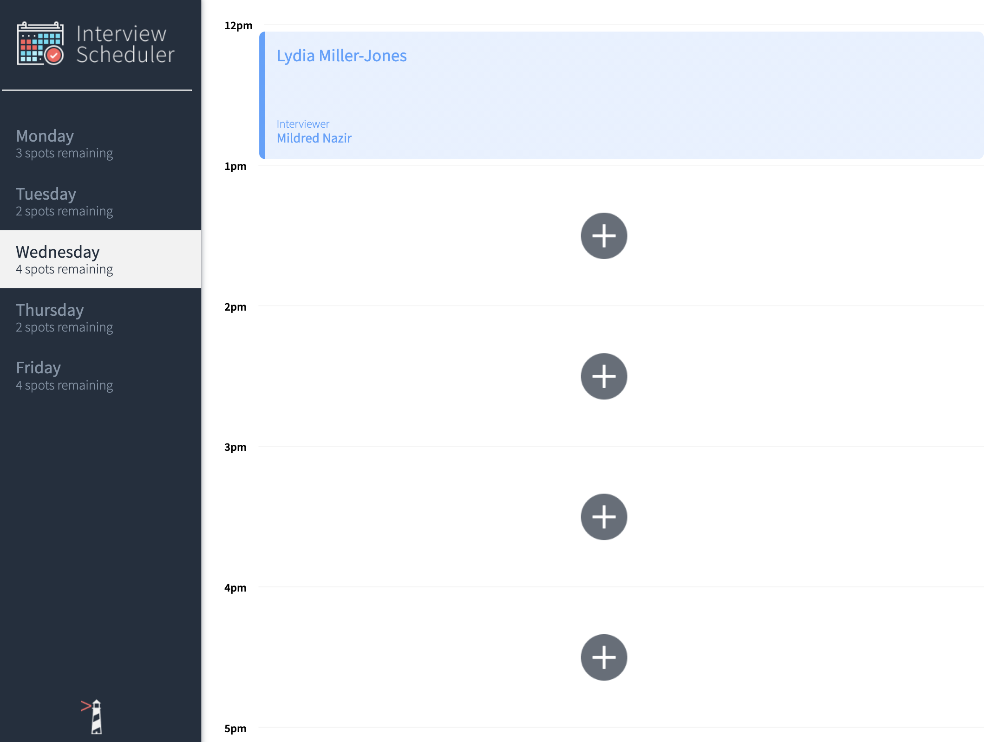
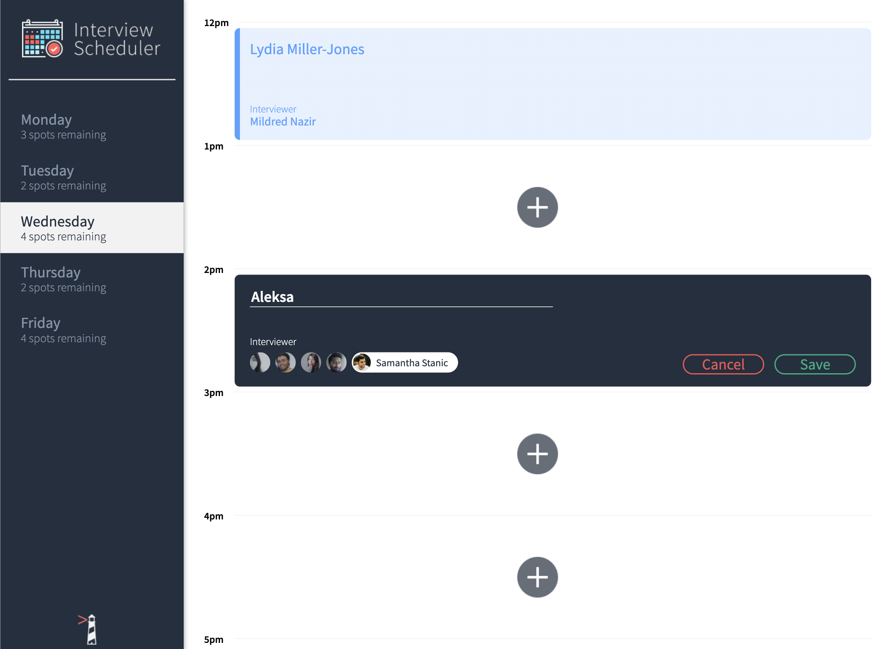
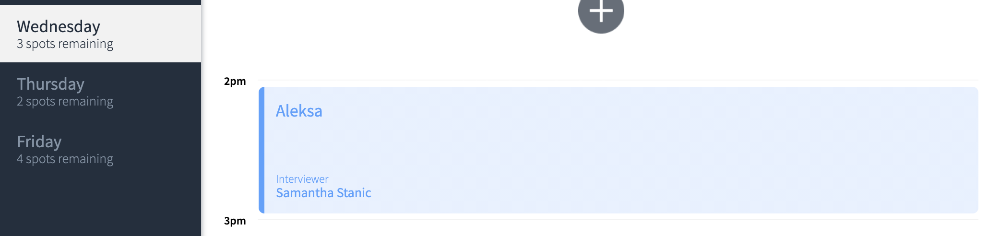
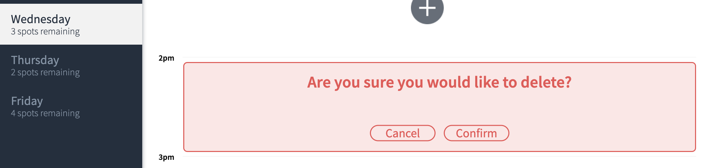

# Interview Scheduler

*This project has been delievered in the 8th week of Lighthouse Labs' Web Development Bootcamp*

## Description

Interview Scheduler is a simple SPA for scheduling appointments. Built using React, it allows users to create, edit, and delete appointments within an arbitrary week. Data is obtained from and saved to an API server using PostgreSQL database, making updates to interviews dynamic.

## Final Product

|  |  |
| ------------- |:-------------:|
|  |  |

## Technology

Single-page application built with modern React practices such as hooks and functional components.

Front-End: HTML, SCSS, React

Back-End: Node, Express, PostgreSQL

## Dependencies

- Axios
- Classnames
- body-normalize.css
- React
- react-dom
- react-hooks-testing-library
- react-scripts

## Testing

This app was extensively tested using the following technologies:

- Storybook for unit testing
- Jest for unit and integration testing
- Cypress for end to end testing

## Setup

Install dependencies with `npm install`.

## Running Webpack Development Server

```sh
npm start
```

## Running Jest Test Framework

```sh
npm test
```

## Running Storybook Visual Testbed

```sh
npm run storybook
```
